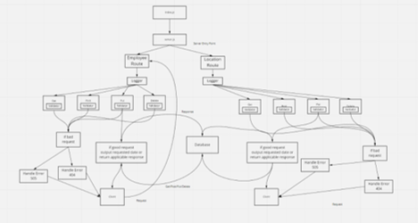

# basic-api-server

Created by Anthony Morton

## Installation
Express, jest, dotenv, supertest, nodemon, pg, sequelize, sequelize-cli, sqlite3

## Summary of Problem Domain
Testing /location and employee route. Testing Get, Put, Post, Delete from database

## Links to application deployment
Location: https://anthonymorton-basic-api-server.herokuapp.com/location
Employee: https://anthonymorton-basic-api-server.herokuapp.com/employee
pull request: https://github.com/anthonylouismorton/basic-api-server/pull/1
actions: https://github.com/anthonylouismorton/basic-api-server/actions

## Include embedded UML

## Talk about your routes

## Routes

* HTTP GET
  * Path: /Employee
    * responds with employee object

* HTTP POST
  * Path: /Employee
    * Adds employee to db

* HTTP PUT
  * Path: /Employee
    * Updates employee in db

* HTTP DELETE
  * Path: /Employee
    * Deletes employee in db

* HTTP GET
  * Path: /Location
    * responds with location object

* HTTP POST
  * Path: /Location
    * Adds Location to db

* HTTP PUT
  * Path: /Employee
    * Updates Location in db

* HTTP DELETE
  * Path: /Employee
    * Deletes Location in db

